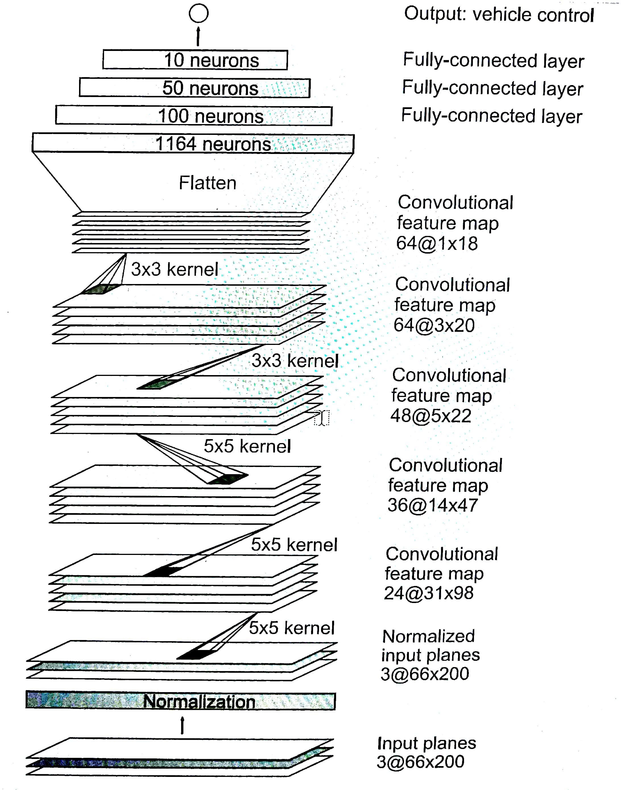

# Behaviorial Cloning Project

Overview
---

The goal of this project is to train a model to autonomously drive a car inside a simulator.

### Approach

I implement the [End-to-End Learning](https://arxiv.org/pdf/1604.07316.pdf) CNN developed by NVidia with slight modifications to drive a car in a simulator (provided my Udacity). Here is the [final report](https://github.com/purnendu23/Behavioral_Cloning/blob/master/final_report.md) and the [code](model.ipynb)

