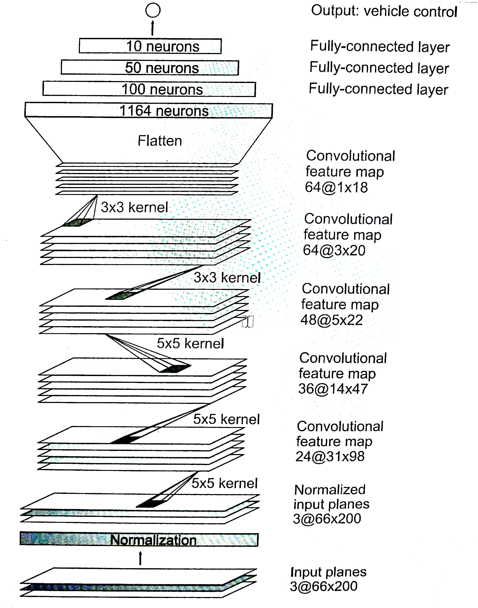

# **Behavioral Cloning** 

[//]: # (Image References)

[image2]: ./examples/placeholder.png "Grayscaling"
[image3]: ./examples/placeholder_small.png "Recovery Image"
[image4]: ./examples/placeholder_small.png "Recovery Image"
[image5]: ./examples/placeholder_small.png "Recovery Image"
[image6]: ./examples/placeholder_small.png "Normal Image"
[image7]: ./examples/placeholder_small.png "Flipped Image"

### Required Files
Submission includes all required files and can be used to run the simulator in autonomous mode

My project includes the following files:
* [You are reading the final report](https://github.com/purnendu23/BehaviouralCloning/edit/master/final_report.md)
* [model.py](https://github.com/purnendu23/BehaviouralCloning/blob/master/model_b.h5) script to create and train the model
* [drive.py](https://github.com/purnendu23/BehaviouralCloning/blob/master/drive.py) script to drive the car in autonomously
* [model.h5](https://github.com/purnendu23/BehaviouralCloning/blob/master/model.h5) Trained CNN 

### Quality of Code

#### * Submission includes functional code
Using the Udacity provided simulator and my drive.py file, the car can be driven autonomously around the track by executing 
```sh
python drive.py model.h5
```
#### * Submission code is usable and readable

The model.py file contains the code for training and saving the convolution neural network. The file shows the pipeline I used for training and validating the model, and it contains comments to explain how the code works.


### Model Architecture and Training Strategy

#### 1. Model architecture

I have used the [NVidia end-to-end learning model for self driving cars](https://images.nvidia.com/content/tegra/automotive/images/2016/solutions/pdf/end-to-end-dl-using-px.pdf) with some slight changes to fit the problem at hand. The figure below shows the original model



A cropping layer was added after the normalization layer. This network which now consists of 10 layers, starts with a normalization layer, followed by a cropping layer, 5 convolutional layers and finally 3 fully connected layers leading to the output. (model.py cell:4 line:12-24)

The second layer of the network (cropping layer) was added by me to crop each training image by 50 pixels from the top and 20 pixels from the botton. 

#### 2. Reduce overfitting in the model

The model was trained on a training set and then validated using a validation set to ensure that the model was not overfitting. The model was finally tested by running it through the simulator to drive the car autonomously.

#### 3. Model parameter tuning

The model used an adam optimizer (learning rate was not tuned manually) and mean square error(mse) as loss metrics,  (model.py cell:4 line:27)

#### 4. Appropriate training data

I used training data from driving the car for several laps (~ 25209 images were recorded). I augment the trainig and validation batches (using the `augment_images(images, measurements)`) to get sufficient samples for right turns because there is disproportionate higher number of left turns in the data collected which would lead to biased training.

### Model Architecture and Training Strategy

#### 1. Solution Design Approach

I straight away started with the Nvidia self-driving car network. I do not add the cropping layer or use data augmentation for preprocessing the data at this stage. However I use all three(center, left and right) camera angle images to train the model with the correction factor added and subtracted to the steering angle for left and right camera images respectively.
As a result the car just drives itself! However, it tends to turn left almost always and gets stuck immediately on the side-banks.
I then change the code to augment the data with flipped images so that the car can also train for right-side turning. At this stage I also define the generator (`generator(samples, batch_size)`) to make training faster.
Now the network was able to train faster and car was driving much better.
I play around with the parameters to fix the batch size at 128 and epoch# 5 to get a very good result. The car was able to drive one complete lap. The good and bad thing at this stage was that it would sometimes veer onto the side of the road, but then recover (Road hazard for simulator pedestrians).

Finally I reallized that perhaps my training data itself is not very good, because I had made a lot errors while driving recklessly and went over the banks several times. At this stage, I drive the car again to get some fresh training data and use that.

At the end of this process, the vehicle is able to drive autonomously around the track without leaving the road.

#### 2. Final Model Architecture

The final model architecture (model.py lines 12-24) consisted of a convolution neural network with the following layers:


#### 3. Creation of the Training Set & Training Process

To capture good driving behavior, I first recorded two laps on track one using center lane driving. Here is an example image of center lane driving:

![alt text][image2]

I then recorded the vehicle recovering from the left side and right sides of the road back to center so that the vehicle would learn to .... These images show what a recovery looks like starting from ... :

![alt text][image3]
![alt text][image4]
![alt text][image5]

Then I repeated this process on track two in order to get more data points.

To augment the data sat, I also flipped images and angles thinking that this would ... For example, here is an image that has then been flipped:

![alt text][image6]
![alt text][image7]

Etc ....

After the collection process, I had X number of data points. I then preprocessed this data by ...


I finally randomly shuffled the data set and put Y% of the data into a validation set. 

I used this training data for training the model. The validation set helped determine if the model was over or under fitting. The ideal number of epochs was Z as evidenced by ... I used an adam optimizer so that manually training the learning rate wasn't necessary.

### Architecture and Training Documentation

### Simulation
